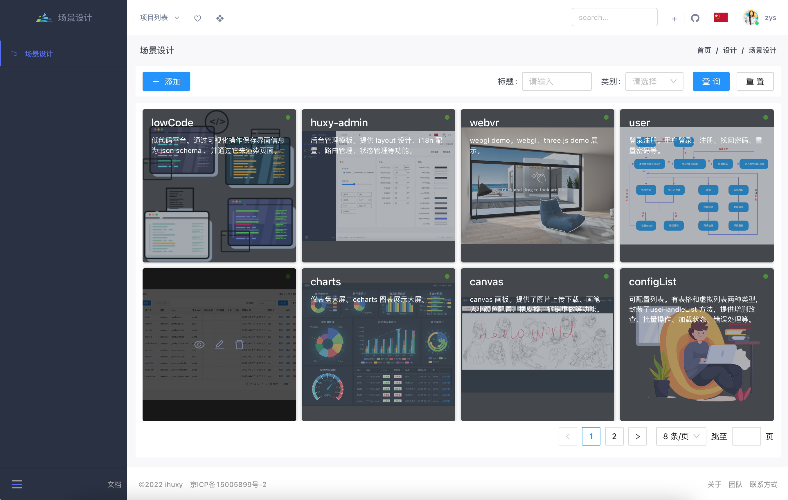
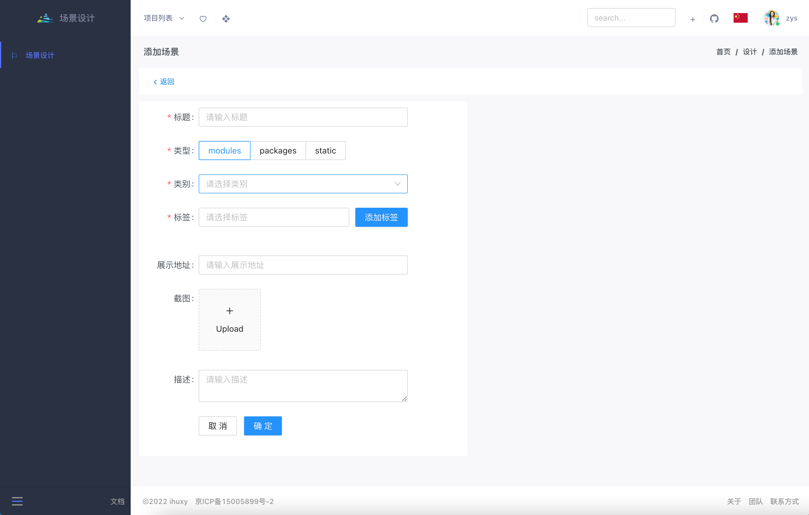
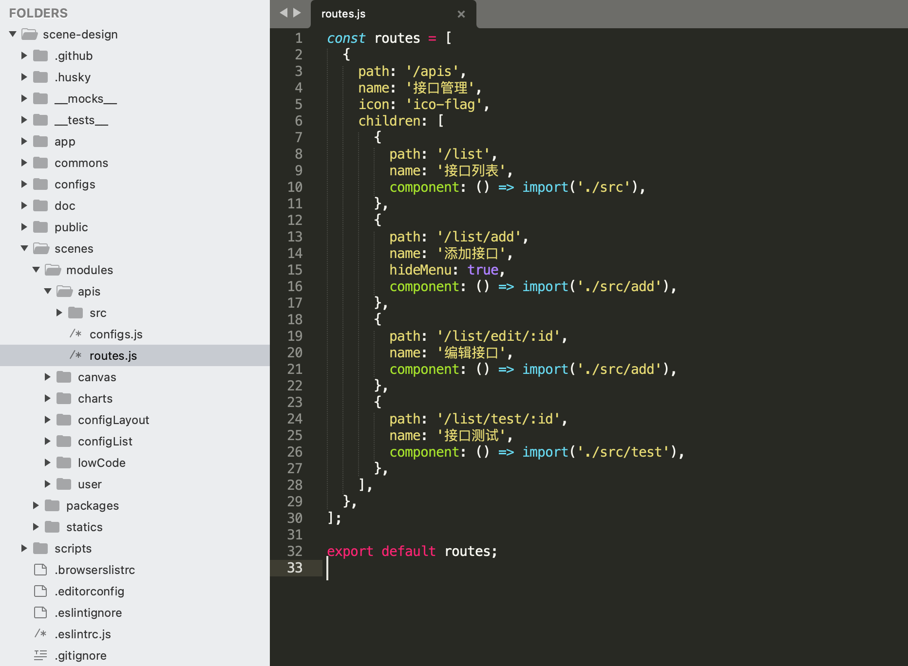

## 场景设计

[](https://github.com/ahyiru/ihuxy/blob/develop/LICENSE)
[](https://www.npmjs.com/package/@huxy/router)
[](http://ihuxy.com/)


> 有人的地方，就有江湖。

人的需求是永远不满足的，因为总有更好的方法可以去满足得更好。场景与需求相伴相生，需求从来无法脱离于场景存在，而新的需求又会创造出新的场景。当我们在写代码时，其实我们都在写一个故事，而场景就是故事中的每一个片段。

大多数情况下，我们写的代码毫无意义。经过技术更新、需求迭代、人员更替，我们花了太多的时间和精力去做技术实现，然而这些代码随时都会被我们（或其他人）抛弃，然后继续重复着需求开发。需求还是那个需求，实现上却更替了一轮又一轮。有时候当你写出了一段感动到自己的代码时，你应该提醒自己：没人在意你写了啥玩意儿，满足当下需求就行了。

那么，我们怎样才能积累更多的场景素材并提高我们的工作转化率呢？

### 简介

场景就是 **_一个片段_**，描述了谁在什么什么时间什么地点做了什么。

场景可能是一个功能模块、工具、内容展示、信息交互等。一个需求可以有多个展示场景，可以根据喜好、心情、环境等作出不同设计。

场景是可能是一个简单的模型，描述了复杂的现象。

### 功能

#### 积累

场景设计可以帮我们积累素材，减少重复的、不必要的开发工作。

需求千千万，终究也是昙花一现。我们可以将各种场景需求积累起来，需要的时候选择一种场景实现即可。

#### 共享

场景设计为我们提供更多可能性。我们可以分享和发现一些有意思的想法，共同交流心得、完善需求。

不要妄想有能力一劳永逸地解决问题，但我们可以有更多的选择。

### 实现

基于 [web-design](https://github.com/ahyiru/web-design) 模版开发。

`web-design` 是一个快速设计并开发项目的平台。

- 提供了项目管理、项目接口管理、项目路由管理
- 提供框架 layout 设计、主题设计、i18n 设计
- 提供了 low-code 页面开发，通过可视化操作创建界面
- 提供了业务组件、基础组件、hooks、utils 设计开发思路及模板
- 提供了工程化模板，如 代码规范、单元测试、版本管理、提交规范等
- 提供了 node.js 创建服务、连接数据库、文件管理等功能模板

该系统提供了场景（需求）的增删改查功能，提供了场景的展示方式。



#### 添加场景（需求）

我们可以添加自己的场景或需求，是场景给出展示方式即可，需求的话提供需求描述或描述地址链接。

我们可以查看自己感兴趣的场景或去实现别人提出的需求。



#### 场景展示

提供了四种场景展示方式：

- 链接。提供展示地址链接即可。
- modules。代码模块，提供完整的功能，配置好路由即可运行。
- packages。一个完整的项目，包含了构建打包等。
- static。静态页面。



主要讲解一下 `modules` 和 `packages` 。

**_`modules`_**

`modules` 里面包含路由配置及一些通用配置。

`routes.js` ：

```js
const routes = [
  {
    path: '/apis',
    name: '接口管理',
    icon: 'ico-flag',
    children: [
      {
        path: '/list',
        name: '接口列表',
        component: () => import('./src'),
      },
      {
        path: '/list/add',
        name: '添加接口',
        hideMenu: true,
        component: () => import('./src/add'),
      },
      {
        path: '/list/edit/:id',
        name: '编辑接口',
        component: () => import('./src/add'),
      },
      {
        path: '/list/test/:id',
        name: '接口测试',
        component: () => import('./src/test'),
      },
    ],
  },
];

export default routes;

```

`configs` 里面提供了一些通用配置：如接口、全局配置、静态资源等。

`configs.js` ：

```js
import apis from '@app/utils/getApis';
import * as configs from '@app/utils/configs';
import * as rules from '@app/utils/rules';

export const apiList = apis;
export const formConfigs = configs;
export const formRules = rules;

```

`src` 目录里面就是模块的主体，可以是一个组件或一个完整的功能模块。

该模块下可自定义 Layout、theme、i18ns等。

**_`packages`_**

一个完整的项目工程。

本地运行：`npm run start --dirname='scenes/${name}'`

可自行配置运行端口等。

打包：`npm run build --dirname='scenes/${name}'`

该项目打包至主项目打包的根目录下，`/scenes/packages/${name}` ，直接访问该路由即可。

#### 路由配置

```js
import {browserRouter} from '@app/configs';
import lowCodeRoutes from '@scenes/modules/lowCode/routes';
import apisRoutes from '@scenes/modules/apis/routes';
import userRoutes from '@scenes/modules/user/routes';
import configListRoutes from '@scenes/modules/configList/routes';
import ConfigLayout from '@scenes/modules/configLayout/src';
import CanvasTest from '@scenes/modules/canvas/src';
import ChartTest from '@scenes/modules/charts/src';

const scenesRoutes = [
  {
    path: '/scenes',
    name: '场景展示',
    denied: browserRouter,
    children: [
      {
        path: '/modules',
        name: '模块',
        icon: 'ico-layout',
        component: props => {
          const {hasLayout} = props.current[2] ?? {};
          return hasLayout ? props.children : <div style={{overflow: 'auto', '--screenvh': 'calc(100vh - var(--breadHeight) - 10px)'}}>
            <div className="main-top" style={breadStyle}><Bread {...props} /></div>
            <div style={{marginTop: 'calc(var(--breadHeight) + 10px)'}}>{props.children}</div>
          </div>;
        },
        children: [
          ...lowCodeRoutes,
          ...apisRoutes,
          ...userRoutes,
          ...configListRoutes,
          {
            path: '/configLayout',
            name: '框架配置',
            icon: 'ico-flag',
            component: props => <Panel>
              <span style={{marginRight: 10}}>{props.name}按钮</span>
              <ConfigLayout {...props} />
            </Panel>,
          },
          {
            path: '/canvas',
            name: '画板',
            icon: 'ico-flag',
            component: <CanvasTest />,
          },
          {
            path: '/charts',
            name: '仪表盘',
            icon: 'ico-flag',
            component: <ChartTest />,
          },
        ],
      },
      {
        path: '/packages',
        name: 'packages',
        icon: 'ico-layout',
        children: [],
      },
      {
        path: '/statics',
        name: 'statics',
        icon: 'ico-layout',
        children: [],
      },
    ],
  },
];

export default scenesRoutes;

```

[项目地址](https://github.com/ahyiru/scene-design)
