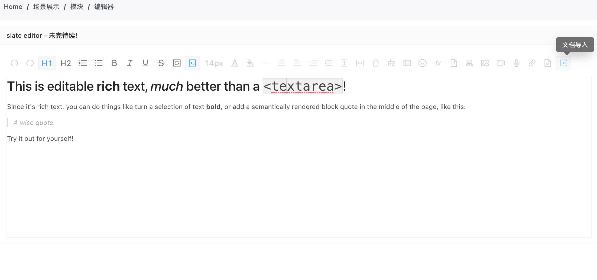

## 富文本编辑框架 slate

Slate 是一个 完全 可定制的富文本编辑框架。

Slate 所有逻辑都是通过一系列的插件实现的，这样，你就再也不会被某项特性 在 或 不在 编辑器【核心】边界之内的问题所困扰了。你可以将它理解为在 React 和 Immutable 基础上，一种可插拔的 contenteditable 实现。另外，它的灵感来自于 Draft.js，Prosemirror 和 Quill 等类库。

正因如此，Slate 并不是开箱即用的，需要自己二次开发许多内容，可基于它定制自己的富文本编辑器。



### 原则

- 作为一等公民的插件。
- 精简 Schema 的核心。
- 支持嵌套的文档模型。
- 无状态、不可变的数据。
- 直观的 changes。
- 为协同编辑准备的数据模型。
- 明确的【核心】边界划分。

### 安装

```
pnpm i slate slate-react
```

### 数据结构

```javascript
const initialValue = [
  {
    type: 'paragraph',
    children: [{text: 'This is editable '}, {text: 'rich', bold: true}, {text: ' text, '}, {text: 'much', italic: true}, {text: ' better than a '}, {text: '<textarea>', code: true}, {text: '!'}],
  },
  {
    type: 'paragraph',
    children: [
      {
        text: 'Since it\'s rich text, you can do things like turn a selection of text ',
      },
      {text: 'bold', bold: true},
      {
        text: ', or add a semantically rendered block quote in the middle of the page, like this:',
      },
    ],
  },
  {
    type: 'quote',
    children: [{text: 'A wise quote.'}],
  },
  {
    type: 'paragraph',
    children: [{text: 'Try it out for yourself!'}],
  },
];

```

### 使用

```javascript
<Slate editor={editor} value={value} onChange={value => setValue(value)}>
  <Toolsbar />
  <Editable
    renderElement={renderElement}
    renderLeaf={params => <Leaf {...params} />}
    placeholder="Enter some rich text…"
    spellCheck
    autoFocus
    style={{border: '1px solid #f3f3f3', minHeight: 300}}
  />
</Slate>

```

自定义渲染：

```javascript
const Leaf = ({attributes, children, leaf}) => {
  const {text, ...rest} = leaf;
  Object.keys(rest)
    .filter(Boolean)
    .map(key => {
      const LeafComp = elements[firstUpper(key)];
      children = LeafComp ? <LeafComp>{children}</LeafComp> : children;
    });
  return <span {...attributes}>{children}</span>;
};

const renderElement = ({element, ...rest}) => {
  const Comp = elements[firstUpper(element.type)] || elements.DefaultElement;
  return <Comp {...rest} />;
};

```

### 自定义元素

```javascript
export const DefaultElement = ({attributes, children, ...rest}) => <div {...attributes} {...rest}>{children}</div>;

export const H1 = ({attributes, children}) => <h1 {...attributes}>{children}</h1>;
export const H2 = ({attributes, children}) => <h2 {...attributes}>{children}</h2>;
export const Ol = ({attributes, children}) => <ol {...attributes}>{children}</ol>;
export const Ul = ({attributes, children}) => <ul {...attributes}>{children}</ul>;
export const Li = ({attributes, children}) => <li {...attributes}>{children}</li>;
export const Bold = ({attributes, children}) => <b {...attributes}>{children}</b>;
export const Italic = ({attributes, children}) => <i {...attributes}>{children}</i>;
export const Underline = ({attributes, children}) => <u {...attributes}>{children}</u>;
export const Strikethrough = ({attributes, children}) => <s {...attributes}>{children}</s>;
export const Quote = ({attributes, children}) => <blockquote {...attributes}>{children}</blockquote>;
export const Code = ({attributes, children}) => <code {...attributes}>{children}</code>;

```

### 事件处理

#### 选中与取消

```javascript
export const toggleMark = (editor, format) => {
  const isActive = isMarkActive(editor, format);
  if (isActive) {
    Editor.removeMark(editor, format);
  } else {
    Editor.addMark(editor, format, true);
  }
};

export const isMarkActive = (editor, format) => {
  const marks = Editor.marks(editor);
  return marks ? marks[format] === true : false;
};

```

#### 选中文本处理和行处理

```javascript
const LIST_TYPES = ['ul', 'ol'];

export const toggleBlock = (editor, format) => {
  const isActive = isBlockActive(editor, format);
  const isList = LIST_TYPES.includes(format);
  Transforms.unwrapNodes(editor, {
    match: n => LIST_TYPES.includes(!Editor.isEditor(n) && Element.isElement(n) && n.type),
    split: true,
  });
  const newProperties = {
    type: isActive ? 'paragraph' : isList ? 'li' : format,
  };
  Transforms.setNodes(editor, newProperties);
  if (!isActive && isList) {
    const block = {type: format, children: []};
    Transforms.wrapNodes(editor, block);
  }
};

export const isBlockActive = (editor, format) => {
  const [match] = Editor.nodes(editor, {
    match: n => !Editor.isEditor(n) && Element.isElement(n) && n.type === format,
  });
  return !!match;
};

```

### 总结

Slate 使用灵活，可拓展性强，方便用于定制自己的富文本编辑器。正因如此，它并不是开箱即用，需要自己二次开发。

以上为简单把玩的 demo，抛砖引玉。